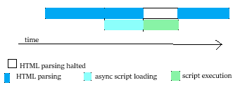
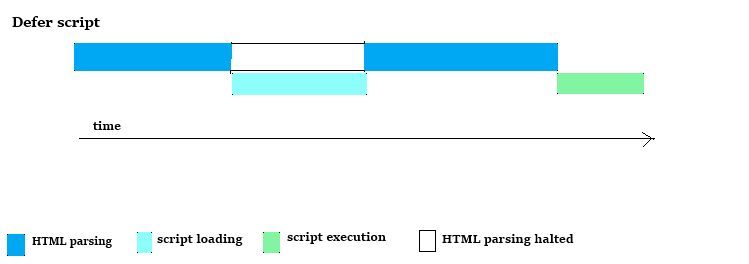
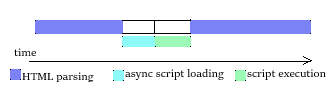

# NamasteReact 🙏 🚀

## Chapter 01-Inception

### Theory Assignment

### What is Emmet ?

- emmet is a toolkit to write code using abbrevations for languages such as HTML, XML and CSS, PHP etc .
- the user needs to know a bunch of shortcuts keys to get the expansion of the shortcut text

  - typing **'!'** will give the HTML boiler plate
  - typing **'html:5'** will also display the HTML boiler plate

- example 2:

```html
ul>li*2
```

will expand as

```html
<ul>
  <li></li>
  <li></li>
</ul>
```

---

- Element.append() v/s Element.appendChild()
  _append()_
  => append() allows you to append **string objects along with NODE objects**,
  => append() _does not returns_ any onject.
  => appends several nodes and strings

  _appendChild()_
  => appendChild() allows you to append only **NODE** objects,
  => appendChild() also _returns_ the node object.
  => appends only one node

---

###### most costly operation in internet?

=> manipulating DOM, that changes the nodes in DOM-tree

- What is React.createElement()
  ==> creates an object,

#### what is render()

takes the object(element), converts this object as html-tag , converts the specified 'h1' tag and puts up on DOM

- what is a react-Element
  => _react-element_ is **JavaScript Object**
  => ReactElement(Object) => HTML (that Browser understands)

* **_Order of the code (i.e. order of script -tag, CDN links, heading, tags etc. ) MATTERS!!!!!!!_**

* root.render() => replaces the code written in HTML root-element with the attached script's(React code)that renders inside Root-element only

### What is the difference between library and framework?

Library:

- pre-written code such as functions, methods, objects, classes to optimize program/task, also to solve specific common problems.
- example: NumPy for ML, Matplotlib for Python, Apache Spark for Scala, Python, Java and SQL, React, Redux, jQuery
- can be replaced by another library, if a particular one doesn't solve a problem/ do a specified task.
- the programmer has control over the application flow, when and where to contact the library.
- needs less code, hence improving the performance and load time

Framework:

- Frameworks generally includes a present architecture or design that developers must work within. Frameworks often focus on functioning as an all-in-one solution for a specific methodology.
- Includes a vareity of APIs, compilers, support applications, libraries, etc.
- can't be replaced easily
- inversion of control, i.e. the framework calls us, i.e. the framework controls the flow.
- large amount of code, that reduces the performance and increases load time.
- examples of framework are Angular, Django, Express, SpringRails

  ***

### What is CDN ? Why do we use it?

- CDN is a network of servers to speed up the content delivery of web page content such as HTML, CSS or Javascript, images, videos, etc, by temporarily storing thse files (i.e. caching) and sending these content to user

- We use it for the number of advantages CDN provides those are as follows:

  - **performance** due to

    - reducing the distance between origin server and user hence, reducing the response time
    - reducing the file size that increase the load speed

  - **Reliability**: that balances the load of network traffic
  - **Redundancy** : if a server/ a data center goes down, CDN will have content from other networks to deliver to the user.
  - **Cost saving** : reducing the number of trips **to and from the origin server** reduces the charge of data transfer between origin-server and User (called as bandwidth cost)
  - **Resilience against attack** : CDNs defends websites from denial-of-service (DoS) and distributed denial-of-service (DDoS) attacks that is capable to absorbs a large amount of traffic.

---

### Why is React known as React?

- React (**core of react, react framework algorithm**) is one of many libraries and it’s completely frontend and specializes in things that the user interacts with when they’re using a website like mouse clicking, submitting and typing.
- while using React, the website is divided into smaller **components** like header, title, images, texts, footer etc.
  Changing a component will re-render the particular component, not the whole website.
- **JSX** allows to build components using properties which makes it possible to insert custom data into the components.

- **Virtual DOM**
- React create a Virtual DOM using JSX and compares it with the actual DOM, and then replaces wherever the changes are observed clled as **Selective Updating** resulting in **better load time** and **computing power**.

  ***

### What is cross-origin in Script tag?

- crossOrigin is an HTML attribute that sets the mode of the request of resources (images, audio, video, scripts, fonts etc.) and provides support for CORS.
- CORS is used to manage cross-origin requests.
- Cross-origin-resourse-Sharing--> is a mechanism to allow when the resourses of a web-page is requested by a domain (or scheme or port) that is outside the wep-pages domain.
- defines a way a browser and a server interacts and decide if the cross-origin request is safe or not.
- CORS relies on a mechanism by which a "preflight" is made from browser to request the server that is hosting the cross-origin resources, to check the permit of actual request by sending headers of HTTP methods and actual request.

---

### What is the difference between react and reactDOM. Also why both are available over CDN link?

- **React** library has react source for creating components, state, props.
- **ReactDOM** (used for _DOM operations_ i.e. _manipulating the DOM_)
  => ReactDOM library is responsible to actually render UI in the browser i.e. mounting the application to the index.html file with ReactDOM.render().
  - **_acts as a bridge between React and Browser(DOM)_**
- The reason React and ReactDOM were split into two libraries was due to the arrival of React Native.
- **React contains functionality utilised in web and mobile apps. ReactDOM functionality is utilised only in web apps.**

---

### What is difference between react.development.js and react.production.js files via CDN?

- During development, you're building and running the application on your local machine. Going to production is the process of making your application ready to be deployed and consumed by users.
- **react.development.js** file in CDN is used by developers to build, test the app before deployment.
  Developers will be running the code locally using the development mode where React provides us with many helpful warnings and tools for easily detecting and fixing problems in our application code and eliminating potential bugs. However, these extra codes increase bundle size and hence, a slower running app.
- **react.production.js** is Minified and optimized because this version of the app is ready for deployment for customers use and thereby making it smooth to run on their device.

---

### What is async and defer?

- **Async** is a boolean attribute in script tag, which is a way to load and execute the script file asynchronously.
- 
- 

-
- _Firstly_ the browser starts _HTML parsing_.
- when browser _encounters async-script tag_, the _script starts loading simultaneously_. during script loading, the HTML file continues parsing.
- after script file is loaded, the _script file starts executing_, during this time the _HTML parsing is halted_.
- _HTML parsing continues_ after the execution of async-script

- **Defer** is another boolean attribute in script tag,
- 
-
- that is a way to parse the HTML file first before the execution of the script file. The script file gets loaded and waits for HTMl file to finish parsing, and only after this, the script file executes.

- **Normally**,
- 
-
- i.e; without async or defer,
- the browser starts HTML parsing.
- when encounters script file, the _HTML parsing stops during the script file loading and execution time_.
- after script file execution, the HTML parsing continues.

- **Dynamic Scripts** are by-default async in nature.
- they are made to work as defer after making the async as false by **script.async=false**

---

#### code to check by your own in "browser console" (not in VSCode) (not to be included in git-code)

```javascript
// window.document
//React
//ReactDOM
//unpkg.com/react@18/umd/react.development.js
//unpkg.com/react-dom@18/umd/react-dom.development.js
// heading.innerHTML = "Namaste to Everybody from Javascript. ";
// React.createElement()
```

#### react basics

### Coding Assignment

##### Q1.

- helloWorld in HTML

```html
<body>
  <h2>Hello World</h2>
</body>
```

---

- helloWorld in Javascript

```html
<body>
  <div id="root"></div>

  <script src="script.js"></script>
</body>
```

```javascript
const heading = document.createElement("h1");
heading.innerHTML = "Namaste to Everybody from Javascript. ";
const rootElement = document.getElementById("root");
// rootElement.append(heading);
rootElement.appendChild(heading);
```

---

- helloWorld in React

  ==> add CDN links in HTML page

```javascript
const parent = React.createElement(
  "div",
  { anyAttribute: "any-value", anyProp: "valuey346594865", id: "parent" },
[
  React.createElement(
    "div",
    { id: "child" },
    React.createElement("h2", {}, "h2 tag"),
    React.createElement("h5", {}, "h5 tag")
  )
  React.createElement(
    "div",
    { id: "child" },
    React.createElement("h2", {}, "h2 tag"),
    React.createElement("h5", {}, "h5 tag")
  )]
);

const root = ReactDOM.createRoot(document.getElementById("root"));
root.render(heading);

```
